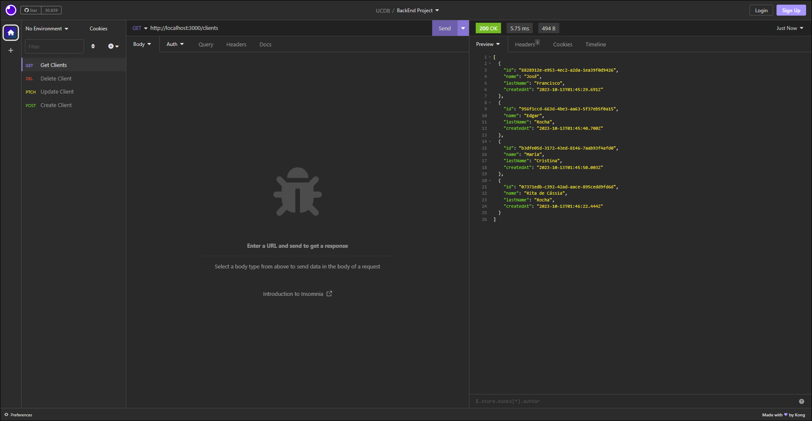

<h1 align="center"> M2 - Programação Back-End </h1>

<p align="center">
  <a href="#-tecnologias">Tecnologias</a>&nbsp;&nbsp;&nbsp;|&nbsp;&nbsp;&nbsp;
  <a href="#-projeto">Projeto</a>&nbsp;&nbsp;&nbsp;|&nbsp;&nbsp;&nbsp;
  <a href="#memo-licença">Licença</a>
</p>

<p align="center">
  
</p>

<br>

<p align="center">
  
</p>

## 🚀 Tecnologias

Esse projeto foi desenvolvido com as seguintes tecnologias:

- Typescript
- Node.js
- Prisma
- Zod

## 💻 Projeto

O Projeto M2 - Programação Back-End é uma API Restfull que permite realizar um CRUD (Create, Read, Update and Delete) para uma base de clientes.

## Rotas

### GET http://localhost:3000/clients

- Descrição: Retorna a lista dos clientes registrados.
- Body:

```js
{
}
```

### DELETE http://localhost:3000/clients

- Descrição: Retorna status code 200. A propriedade 'id' é obrigatória.
- Body:

```js
{
	"id":"b3dfe05d-3172-43ed-8146-7aab93f4afd0"
}
```

### PATCH http://localhost:3000/clients

- Descrição: Modifica um cliente com determina id. Retorna o cliente com dados modificados. A propriedade id é obrigatório, porém 'name' e 'lastName' são opcionais.
- Body:

```js
{
	"id":"956f1ccd-663d-4be3-aa63-5f37eb5f0a15",
	"name":"Edgar",
	"lastName":"Rocha de Arruda"
}
```

### CREATE http://localhost:3000/clients

- Descrição: Criação de novos clientes. Retorna um objeto do cliente criado. As propriedades 'name' e 'lastName' são obrigatórias.
- Body:

```js
{
	"name":"Rita de Cássia",
	"lastName":"Rocha"
}
```

## :memo: Licença

Esse projeto está sob a licença MIT.
